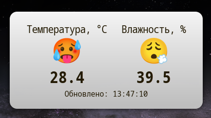

# Home-meteo

Мини домашняя метеостанция на базе Arduino Nano + SHT31 (SHT31-D) и Arch linux
Cinnamon.

[1 Подключение железок.md](README_files/1%20Подключение%20железок.md)

[2 Прошивка arduino.md](README_files/2%20Прошивка%20arduino.md)

[3 Подготовка Десклета.md](README_files/3%20Подготовка%20Десклета.md)

